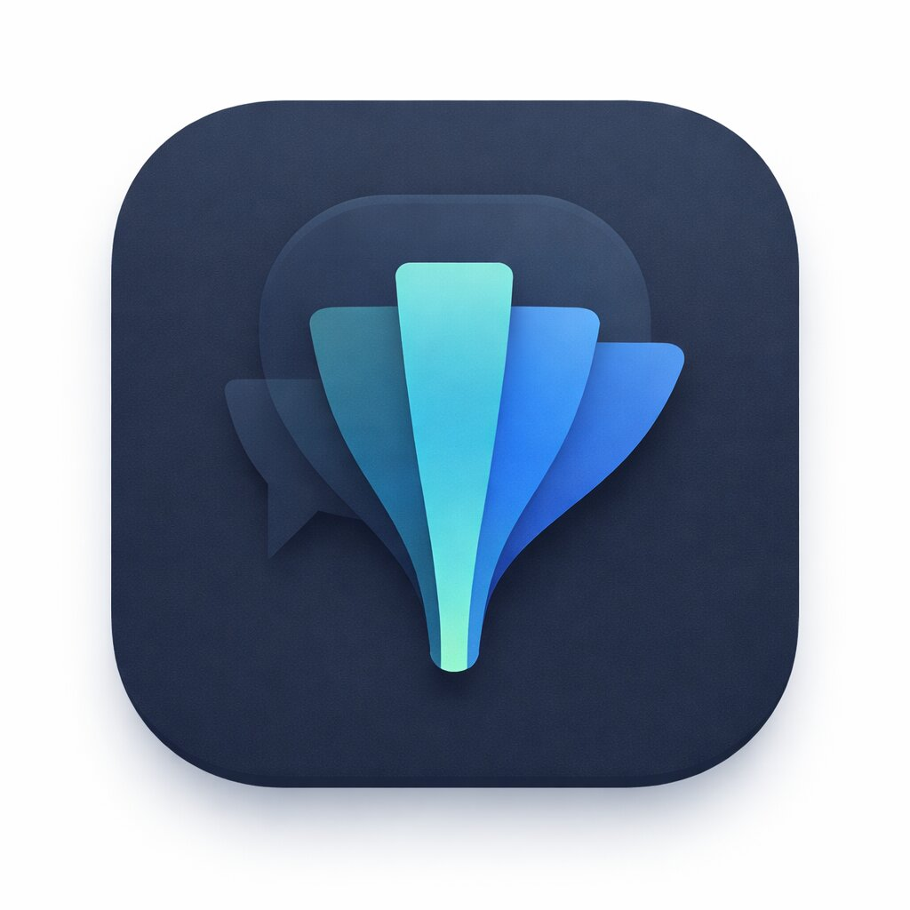

<h1> Filo</h1>

Filo는 필터 제작/공유, 커뮤니티, 결제, 채팅, VOD 시청을 하나의 경험으로 묶은 iOS 앱입니다.  
UIKit 기반 커스텀 UI와 MVVM + RxSwift, async/await를 함께 사용해 실제 서비스 시나리오(로그인/결제/푸시/실시간 채팅/미디어 업로드)를 구현했습니다.

## 프로젝트 요약

- 플랫폼: iOS
- 아키텍처: MVVM + RxSwift + async/await
- 핵심 도메인: 필터 편집/판매, 커뮤니티, 결제, 채팅, 영상 스트리밍
- 구현 포인트: 토큰 재발급 단일화, 실시간 메시지 동기화, 미디어 최적화 업로드, 커스텀 플레이어

## 핵심 기능

- 인증: 이메일/카카오/Apple 로그인
- 홈: 배너(WebView 브릿지), 오늘의 작가, 트렌드 필터
- 피드: Top Ranking 캐러셀 + 리스트/핀터레스트 블록 모드 + 무한 스크롤
- 필터: 사진 선택, 필터 파라미터 조절, EXIF 메타데이터 추출/표시, 필터 등록
- 커뮤니티: 게시글 검색/작성/수정/상세, 이미지+동영상 혼합 미디어 지원
- 결제: PG 결제 연동 및 영수증 검증 플로우 (iamport SDK)
- 알림: FCM/APNs 기반 Push 수신, 앱 상태별 표시 제어, 탭 시 딥링크 이동
- 채팅: 채팅방 목록/대화, 소켓 실시간 수신, Realm 로컬 저장, 푸시 연동
- 영상: HLS 재생, 커스텀 플레이어, 화질/속도/자막 제어

## 기술 스택

| Category | Stack |
|---|---|
| Language |  |
| UI |   |
| Reactive |   |
| Network |  |
| Image |  |
| Realtime |  |
| Local DB |  |
| Auth/Social |   |
| Push/Analytics |   |
| Payment |  |
| ETC |   |

## 아키텍처

- `App`: 앱 생명주기, 루트 전환, 푸시 진입 처리
- `Core`: 인증/네트워크/채팅 로컬스토어/공통 프로토콜 및 확장
- `Feature`: 기능 단위 화면과 ViewModel
- `UI`: 재사용 컴포넌트, 커스텀 탭바
- `Resources`: Assets, plist, entitlements
- `아키텍처 패턴`: MVVM + Input/Output 기반 단방향 데이터 흐름
  - ViewController는 Input 전달/Output 바인딩 중심으로 역할을 제한
  - 상태 변경과 비즈니스 로직은 ViewModel에서 일관되게 관리

## 핵심 기술 포인트

### 1) 인증/토큰 복구 전략 (동시성 + 재시도 정책)
- 문제:
  - 동시 401 상황에서 refresh 중복 호출 시 토큰 경합 발생 가능
  - 요청마다 만료 처리를 따로 두면 실패 분기 누락/중복 구현 위험
- 구현:
  - `TokenStorage(actor)`의 `refreshTask`를 공유해 refresh 단일화
  - `NetworkManager`에서 `401/만료 감지 -> refresh -> 원요청 재실행`을 공통 처리
  - refresh 실패 시 `SessionExpiryHandler`를 통해 세션 종료 UX 일원화
- 정책:
  - 재시도 최대 2회 (최초 포함 총 3회 시도)
  - refresh API(`/auth/refresh`)는 재귀 재시도 금지
  - 인증 헤더 없는 요청은 refresh 분기 제외
- 실패 분기:
  - 앱 시작 세션 복원 실패: 즉시 로그인 화면 전환
  - 앱 사용 중 세션 만료: Alert 노출 후 로그인 화면 전환
- 동시성 시나리오:
  - 동시 401 N건 발생 -> refresh는 1회만 실행 -> 나머지 요청은 동일 task 결과를 공유
- 효과:
  - 중복 refresh 호출 억제, 토큰 상태 정합성 개선
  - 네트워크 계층의 책임 경계가 명확해져 유지보수성 향상

### 2) 메타데이터 원본 우선 추출
- 문제:
  - `PHPicker`에서 얻은 `Data`는 재인코딩/포맷 변환 과정에서 EXIF/TIFF/GPS 유실 가능
  - 특히 `UIImage` 경유(`jpegData()` 재생성)나 HEIC -> JPEG 변환 경로에서 메타데이터 누락 확률 증가
- 우선순위 정책:
  - `PHAsset 원본 파일(fullSizeImageURL) -> Data fallback`
- 구현:
  - `assetIdentifier`가 존재하면 `PHAsset` 조회 후 원본 URL에서 메타데이터 파싱
  - `assetIdentifier == nil` 또는 원본 URL 확보 실패 시 `Data` 기반 추출로 fallback
- 효과:
  - 카메라/렌즈/위치 정보 신뢰도 향상
  - 원본 접근 불가 케이스에서도 사용자 흐름 유지

### 3) 커뮤니티 미디어 업로드 최적화
- 기준: 파일별 5MB 제한
- 이미지: 1600px 리사이즈 + JPEG 단계 압축(`0.8 -> 0.6 -> 0.4 -> 0.3`)
- 영상: `AVAssetExportPresetMediumQuality` -> 실패/초과 시 `LowQuality` 재시도
- 실패 처리: 실패 파일은 경고 상태로 유지하되 업로드 대상에서 제외
- 효과: 전체 작성 실패를 줄이고 실제 업로드 성공률 개선

### 4) 좋아요 낙관적 UI + 정합성 보장
- 문제: 연타 시 응답 순서 역전으로 UI 오염 가능
- 구현: 즉시 낙관적 반영 + trailing debounce + `latestRequestId` 검증 + 실패 롤백
- 효과: 즉시 반응 UX 유지, 마지막 사용자 의도만 확정 반영

### 5) 채팅 동기화 안정화 (API + Socket)
- 문제: 초기 동기화 중 소켓 메시지와 API 이력 중복 저장
- 구현: 동기화 구간 버퍼링 + `chatId` Set 중복 제거 + flush 처리
- 효과: 중복 메시지 방지, 로컬/서버 상태 정합성 유지

### 6) unread 카운트 일관성
- 구현:
  - `ChatLocalStore`에서 unread 증감 규칙을 단일화
  - 채팅 목록 소켓 수신(`ChatRoomListViewModel`)과 포그라운드 푸시 수신(`AppDelegate`) 모두 같은 저장소 규칙 사용
  - 채팅방 진입 시 `resetUnread(roomId:)`로 즉시 0 처리
- 규칙:
  - 현재 보고 있는 방이면 `unread = 0`
  - 현재 방이 아니고 상대 메시지일 때만 `+1`
  - 상한은 `300`으로 제한해 UI는 `300+` 정책 사용
- 효과:
  - 앱 상태(목록/채팅방/다른 화면/푸시 수신)와 무관하게 unread 일관성 유지
  - 백그라운드 복귀/딥링크 진입 후에도 배지 카운트 신뢰성 확보

### 7) 커스텀 HLS 플레이어 고도화
- 구현: `AVPlayer` 기반 커스텀 UI, 자막 파싱/동기화, 설정 시트(화질/속도/자막)
- 화질 전환: 마스터 스트림에서는 URL 교체 대신 `preferredPeakBitRate` 제어
- 효과: 화질 변경 시 재생 리셋 체감 감소, 시청 연속성 향상

### 8) PG 결제 정합성 확보
- 문제: SDK 성공 콜백만으로 구매 확정 시 오결제/위변조 리스크
- 구현: 결제 성공 후 `imp_uid` 기반 서버 영수증 검증 성공 시에만 구매 확정
- 효과: 결제 상태 정합성/신뢰성 강화, 오권한 오픈 방지

### 9) 채팅 이미지 처리 안정화 (프로필 캐시 + 셀 재사용 오염 방지)
- 문제: 채팅/댓글 리스트에서 프로필 캐시에 오래된 이미지가 남아 최신 프로필 반영이 지연되거나, 셀 재사용 구간에서 이미지 오염이 발생할 수 있음
- 구현:
  - Kingfisher 요청 전 `cancelDownloadTask()`로 이전 작업 정리
  - 캐시 키에 `URL + userId`를 결합해 사용자 단위 이미지 식별
  - 로딩 완료 시 `currentProfileKey` 일치 여부 검증 후 불일치 이미지 폐기
  - 채팅 유저 프로필은 `ChatUserObject` + TTL 갱신 + 목록 participant upsert로 최신성 유지
- 효과: 잘못된 이미지 반영을 방지하면서도, 캐시 기반으로 최신 프로필을 안정적으로 유지

## 설계 고려사항

- 단일 책임: 인증/네트워크/로컬 저장소/화면 로직을 분리해 변경 영향 최소화
- API 추상화: `APITarget` 프로토콜 + 도메인별 Router(`UserRouter`, `FilterRouter`, `ChatRouter` 등)로 endpoint/method/header/parameter를 타입 안전하게 관리
- 네트워크 일관성: `NetworkManager` 단일 진입점에서 공통 에러 매핑, 재시도, 인증(토큰 갱신) 정책을 적용
- 동시성 안전: actor, requestId, debounce를 조합해 레이스 컨디션 억제
- 부분 실패 허용: 미디어 업로드 실패를 전체 실패로 확장하지 않고 사용자 흐름 유지
- 정합성 우선: 결제/토큰/채팅 unread처럼 비즈니스 중요 상태는 서버 검증과 규칙 통일 우선
- UX 우선순위: 즉시 피드백(낙관적 반영)과 안전 롤백을 함께 적용
- 성능 예산: 메모리/디스크 캐시 제한, prefetch 기반 선로딩, 목록 요약 모델 분리
- 확장성: 공통 Store/Router/ViewModel 패턴으로 피처 확장 시 재사용성 확보

## 성능/UX 최적화

- 이미지 캐시: memory 120MB, disk 500MB, memory 1h, disk 30d
- 스크롤 로딩: `willDisplay` + `prefetchRows/prefetchItems` 병행
- 채팅 목록: 메시지 전체가 아니라 요약 데이터 중심 렌더링
- 플레이어: 컨트롤 오버레이 자동 숨김, observer 정리로 누수 방지

## 트러블 슈팅 (Troubleshooting)

### 1) Token refresh 동시 호출
- 문제: 여러 API가 동시에 401을 받으면 refresh API가 중복 호출됨
- 원인: 요청별 refresh 처리로 토큰 갱신 경합 발생
- 해결: `TokenStorage(actor)`에 `refreshTask` 공유, 진행 중 refresh는 동일 Task await
- 결과: refresh 폭주 방지, 토큰 정합성 개선, 재시도 흐름 안정화

### 2) PHPicker 메타데이터 유실
- 문제: 선택 이미지의 EXIF/TIFF 정보가 일부 케이스에서 누락됨
- 원인: `Data` 기반 추출 시 재인코딩된 데이터가 들어오는 경우 존재
- 해결: `assetIdentifier`가 있으면 `PHAsset` 원본 URL 우선, 실패 시 `Data` fallback
- 결과: 카메라/렌즈/위치 정보 신뢰도 향상, 예외 상황에서도 등록 흐름 유지

### 3) 댓글 상태/개수 동기화 방식 개선
- 문제: 댓글 작성/수정/삭제마다 fetch API까지 재호출하면 비용이 크고, 댓글은 채팅처럼 초실시간 정합성이 필수는 아님
- 원인: 초기 구현에서 쓰기 API 성공 후 즉시 fetch로 전체 목록을 다시 받아 과도한 네트워크 호출 발생
- 해결: 작성/수정/삭제 API만 호출하고, 성공 응답을 기준으로 `commentsDataRelay`를 즉시 갱신해 UI와 개수를 동기화
- 결과: 네트워크 비용 감소 + 체감 반응 속도 개선 + 재진입 전까지 상태 일관성 유지

### 4) 채팅 unread 누락/과증가
- 문제: unread가 상황에 따라 누락되거나 2배 증가하는 케이스가 발생
- 원인:
  - 목록/채팅방/다른 화면에서 unread 규칙이 분산되어 누락 가능
  - 서버가 이미 push를 발송하는 구조에서 클라이언트가 push API를 추가 호출하면 알림이 중복 수신되어 카운트가 과증가
- 해결:
  - 저장소 계층에서 unread 증감 규칙 통일(`현재 방=0`, `비현재 방+상대 메시지`일 때만 증가)
  - 클라이언트 중복 push 호출 제거, 서버 발송 push만 단일 소스로 사용
  - 포그라운드/목록 소켓 경로를 같은 unread 규칙에 연결
- 결과: 중복 알림/과증가 해소, 화면 맥락과 무관한 unread 일관성 확보(`300+` 상한 유지)

### 5) 좋아요 연타 시 상태 역전
- 문제: 연타 상황에서 늦게 온 이전 응답이 최신 UI를 덮어씀
- 원인: 초기 구현은 `throttle/debounce`로 "마지막 요청만 전송"하는 데 집중했지만, 이미 전송된 이전 요청의 응답이 더 늦게 도착하면 상태를 덮어쓸 수 있었음
- 해결: 낙관적 업데이트는 유지하고, 요청마다 `requestId`를 부여한 뒤 `latestRequestId`와 일치하는 응답만 반영하도록 변경 (불일치 응답은 폐기) + 실패 롤백
- 결과: 즉시 반응 UX 유지, 마지막 의도만 확정 반영

### 6) 검색 -> 상세 전환 후 상태 꼬임
- 문제: 커스텀 전환 후 셀 인터랙션/원복 상태가 깨짐
- 원인: 전환 중 snapshot/원본 뷰 상태 복구 타이밍 불일치
- 해결: push/pop 전환 단계를 분리하고 완료 시점에 상태 강제 복구
- 결과: shared-element 전환 안정화, 재탭 불가/겹침 현상 감소

### 7) 화질 변경 시 재생 리셋
- 문제: 화질 변경마다 영상이 처음부터 재생되는 체감 발생
- 원인: 화질 선택 시 URL 교체 기반 전환으로 버퍼 리셋
- 해결: 마스터 스트림에서는 `preferredPeakBitRate`만 조절, URL 교체 최소화
- 결과: 재생 연속성 향상, 화질 전환 시 끊김/리셋 체감 감소

### 8) 채팅/댓글 리스트 프로필 이미지 오염
- 문제: 캐시에 남은 과거 이미지로 최신 프로필 반영이 늦거나, 재사용 셀에 다른 사용자 이미지가 잠깐 노출됨
- 원인: 비동기 이미지 완료 시점과 셀 재사용 타이밍이 엇갈리고, 프로필 캐시 갱신 주기가 길면 구버전 표시 가능
- 해결: `cacheKey(URL+userId)`와 `currentProfileKey` 검증으로 오염 차단 + `ChatUserObject` TTL 갱신 및 목록 upsert로 최신성 보정
- 결과: 스크롤 구간에서도 오표시를 줄이고, 채팅/댓글 리스트의 프로필 최신성 신뢰도 향상

## 회고

Filo는 화면 구현 자체보다 “실서비스에서 깨지지 않는 흐름”을 만드는 데 집중한 프로젝트였습니다.  
기능을 빠르게 붙이는 것보다, 토큰 갱신 동시성·좋아요 연타 정합성·채팅 동기화 중복 같은 경계 상황을 먼저 정의하고 구조로 해결하는 습관을 갖게 되었습니다.  
특히 `MVVM + Input/Output` 단방향 흐름, `APITarget + Router` 네트워크 추상화, 로컬 스토어 기반 상태 동기화는 기능이 늘어날수록 유지보수 비용을 낮추는 데 효과적이었습니다.  
또한 미디어 업로드 최적화(부분 실패 허용), unread 일관성, 프로필 캐시 최신화처럼 UX와 정합성이 충돌하는 지점에서 기준을 명확히 세우는 경험을 했습니다.  
결과적으로 Filo를 통해 “동작하는 앱”을 넘어 “예외 상황에서도 신뢰할 수 있는 앱”을 설계하는 방법을 체득했습니다.
