<h1>
  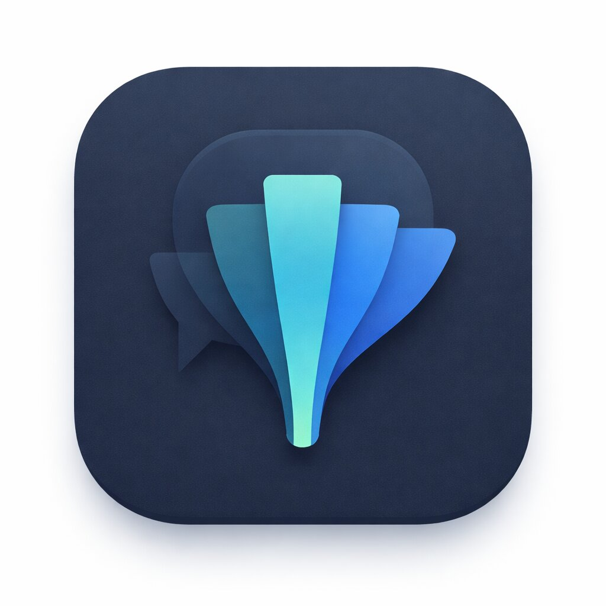
  Filo
</h1>

Filo는 필터 제작/공유, 커뮤니티, 실시간 채팅, VOD, PG 결제를 하나의 사용자 흐름으로 연결한 iOS 앱입니다.
UIKit 기반 커스텀 UI와 MVVM + Input/Output, RxSwift, async/await를 함께 사용해 로그인/결제/푸시/실시간 채팅/미디어 업로드 같은 실제 서비스 시나리오를 구현했습니다.

| 항목 | 내용 |
|---|---|
| 개발 기간 | 2025.12 - 2026.02 |
| 담당 역할 | iOS App Developer |
| 프로젝트 성격 | 팀 프로젝트 |
| 최소 지원 버전 | iOS 16.0+ |

## 목차

- [핵심 기능](#핵심-기능)
- [스크린샷](#스크린샷)
- [기술 스택](#기술-스택)
- [아키텍처](#아키텍처)
- [핵심 구현 포인트](#핵심-구현-포인트)
- [트러블슈팅](#트러블슈팅)
- [실행 방법](#실행-방법)

## 핵심 기능

| 도메인 | 구현 내용 |
|---|---|
| <nobr>인증</nobr> | 이메일 회원가입/로그인, 카카오 로그인, Apple 로그인, Keychain 기반 토큰 저장, 만료 토큰 자동 갱신 |
| <nobr>홈</nobr> | 오늘의 필터, 카테고리, 핫 트렌드, 오늘의 작가, WebView 이벤트 배너 |
| <nobr>피드</nobr> | Top Ranking 캐러셀, 리스트/블록 모드 전환, 정렬, 무한 스크롤, 좋아요 낙관적 반영 |
| <nobr>필터</nobr> | 이미지 선택, EXIF 메타데이터 추출, Core Image 기반 12개 조절값 편집, 원본/적용 이미지 비교, 필터 등록/수정/삭제 |
| <nobr>필터 구매</nobr> | 결제 상태에 따른 조절값 잠금/해제, 구매 후 사진 적용 및 저장 |
| <nobr>커뮤니티</nobr> | 게시글/사용자 검색, 게시글 작성/상세/수정/삭제, 이미지/동영상 혼합 미디어, 댓글/대댓글 |
| <nobr>채팅</nobr> | Socket.IO 기반 실시간 메시지, Realm 로컬 저장, 이미지/PDF 첨부, PDF 미리보기, unread 배지 |
| <nobr>알림</nobr> | Firebase Messaging, FCM/APNs 토큰 관리, 포그라운드 알림, 채팅방 딥링크 |
| <nobr>VOD</nobr> | HLS 스트리밍, 커스텀 AVPlayer, 화질/속도/자막 제어, 전체 화면 전환 |
| <nobr>보안</nobr> | 커스텀 앱 잠금, 생체 인증, 앱 스위처 민감 정보 보호 화면 |

## 스크린샷

| 로그인 | 회원가입 | 메인화면(오늘의 필터) | 메인화면(핫 트랜드 & 오늘의 작가) |
|:---:|:---:|:---:|:---:|
| 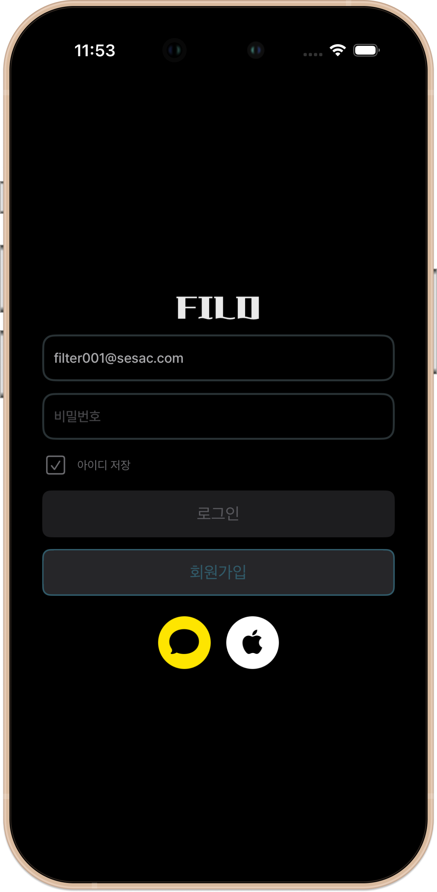 | 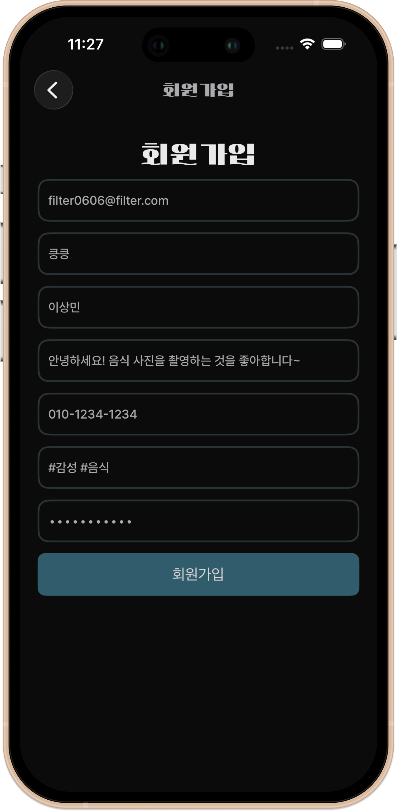 | 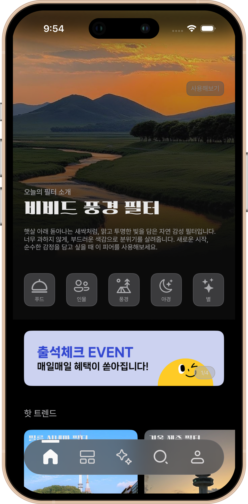 | 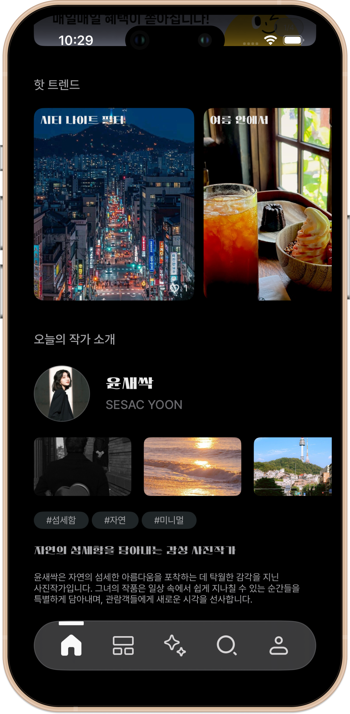 |
| 배너 웹 브릿지 | 배너 웹 브릿지 동작 | 피드(탑 랭킹) | 피드 리스트 |
| 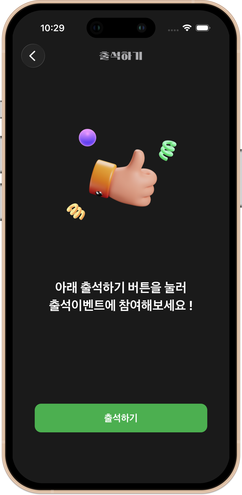 | 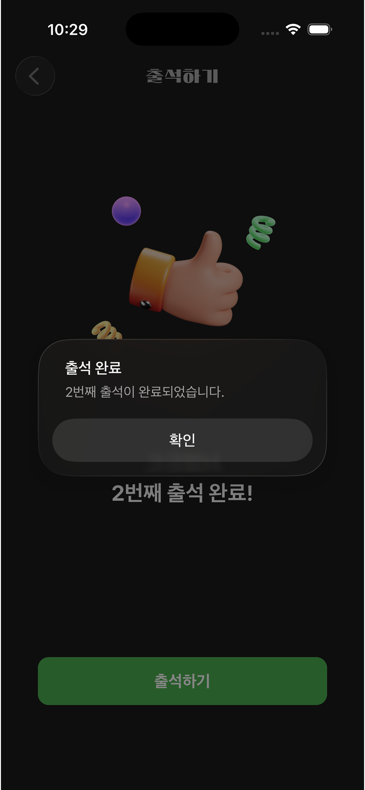 | 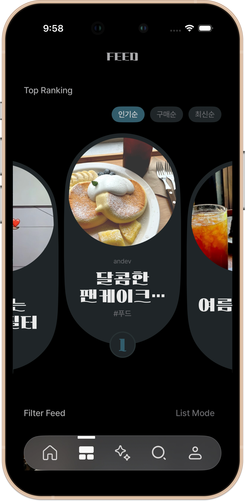 | 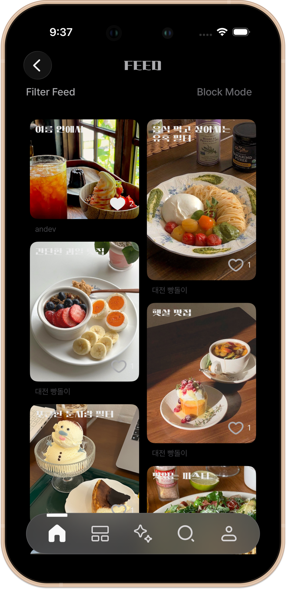 |
| 필터 등록  | 필터 생성 | 필터 편집 | 필터 상세 |
| 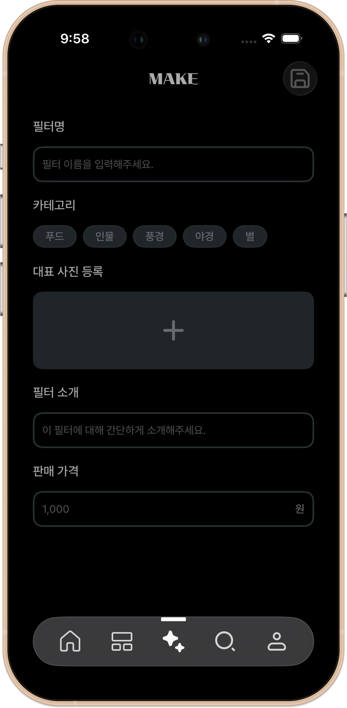 | 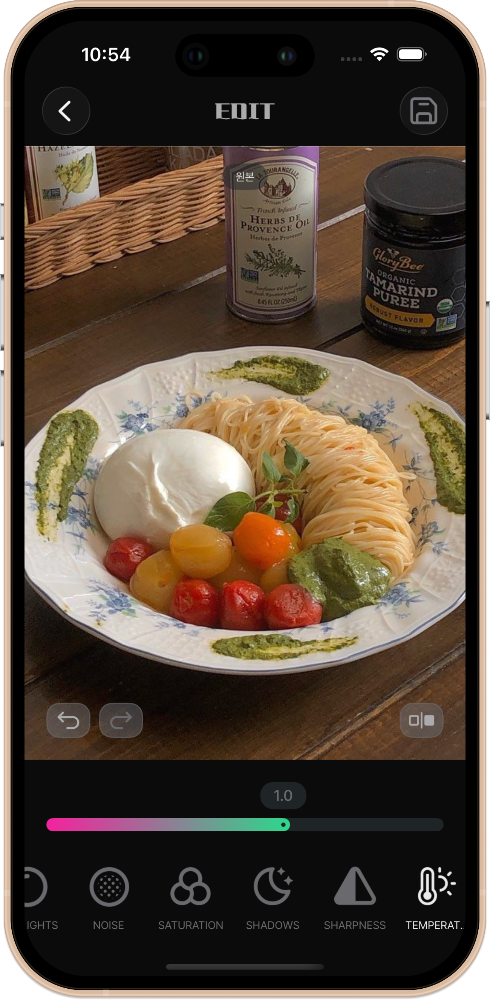 | 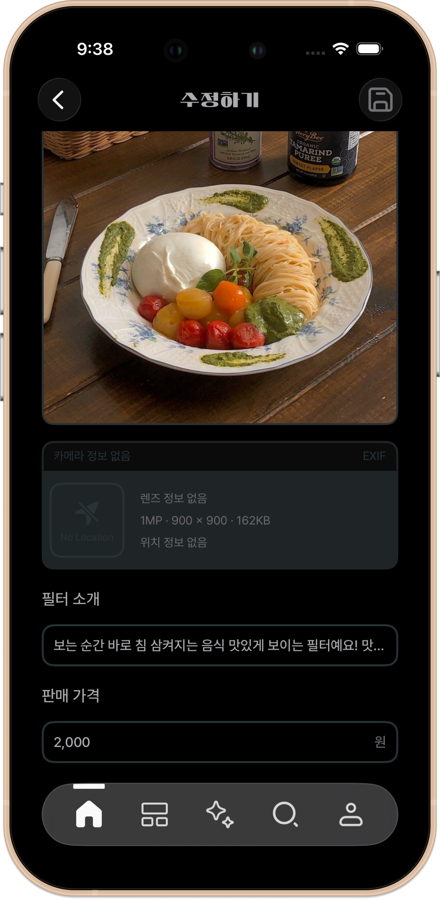 | 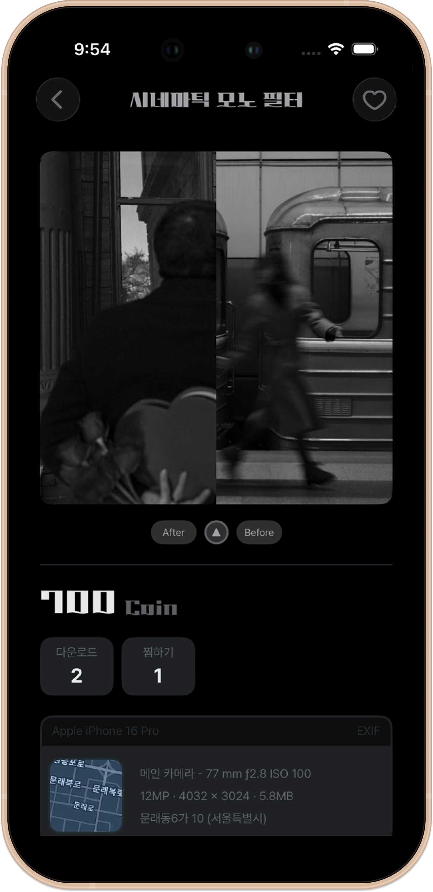 |
| 필터 상세(결제 전) | 필터 상세(결제 후) | 필터 적용 미리보기 | 커뮤니티 탐색 |
|  | 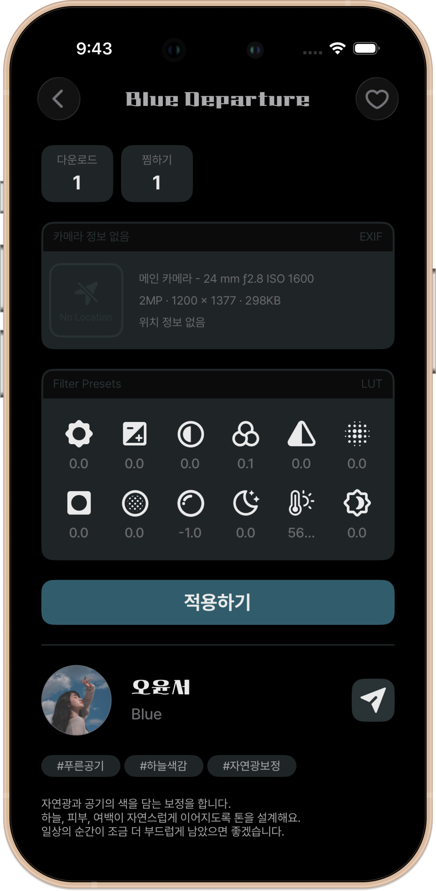 |  | 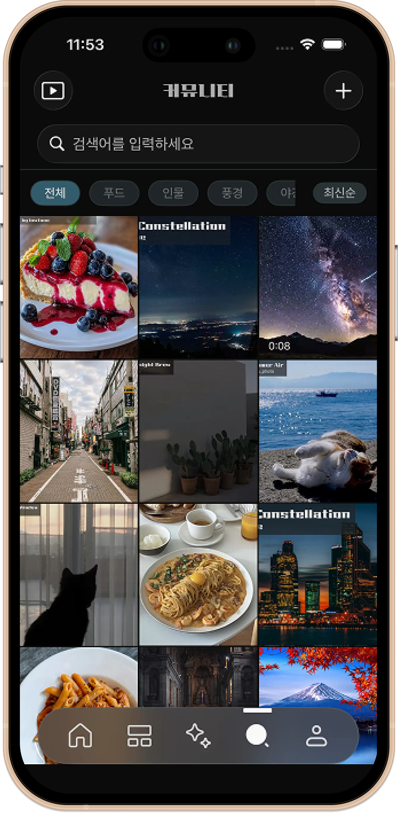 |
| 게시글 상세 | 게시글 작성 | 미디어 프리뷰 | 댓글 |
| 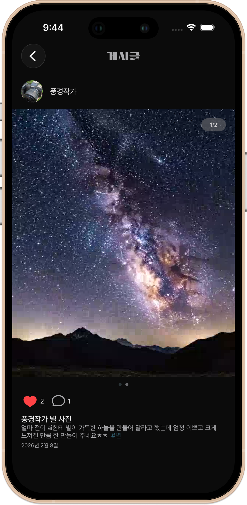 | 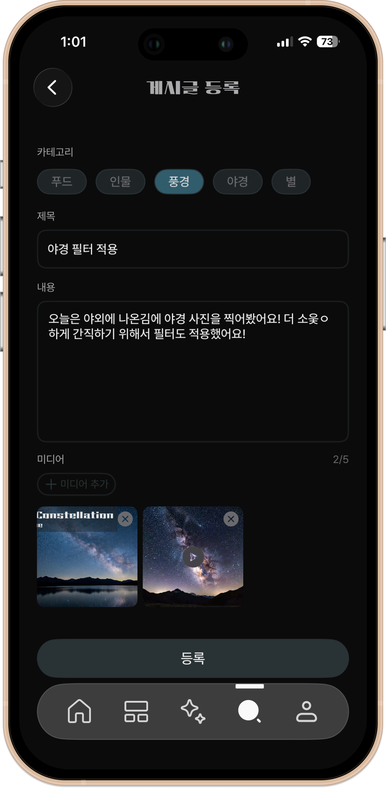 |  |  |
| 대댓글 | 채팅 목록 | 채팅방 | PDF 첨부 미리보기 |
|  | 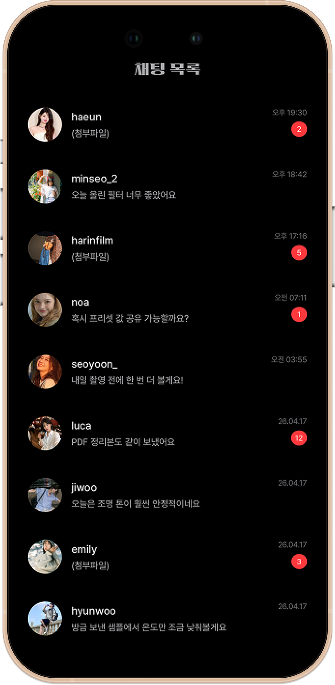 | 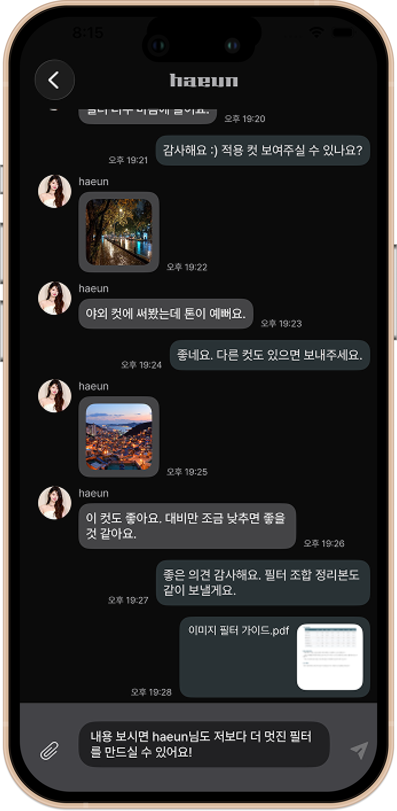 |  |
| 결제 | 결제 검증 | 영수증 | 영상 목록 |
| 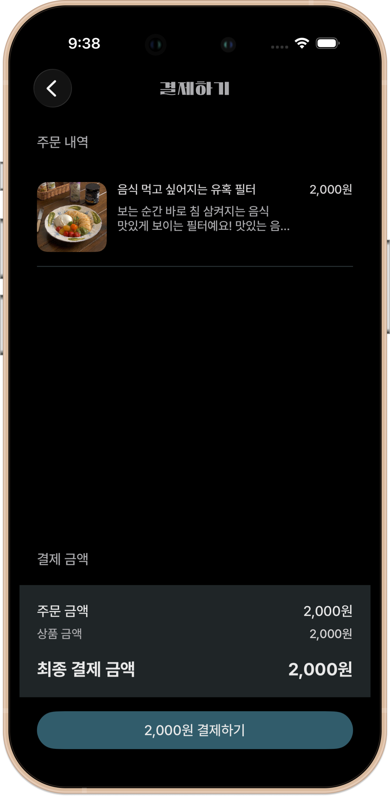 |  |  | 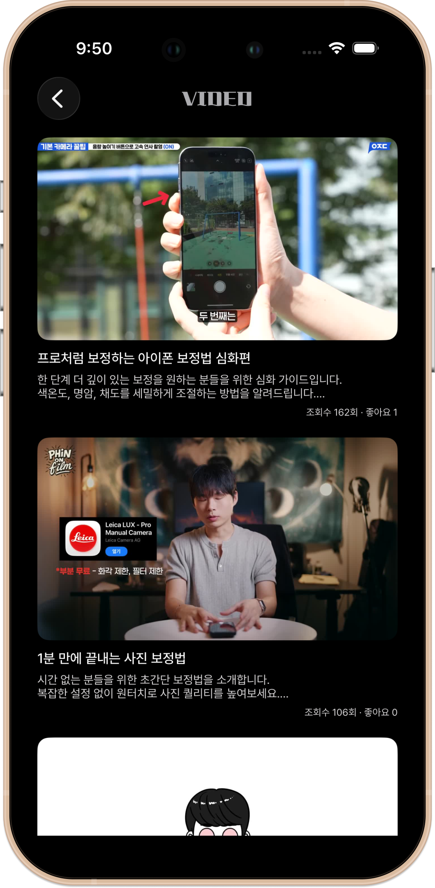 |
| 영상 플레이어 | 전체 화면 플레이어 |  |  |
|  |  |  | |


## 기술 스택

| Category | Stack |
|---|---|
| Language | Swift |
| UI | UIKit, SnapKit |
| Architecture | MVVM, Input/Output|
| Reactive | RxSwift, RxCocoa |
| Network | Alamofire |
| Auth / Security | Keychain, LocalAuthentication, Kakao SDK, Sign in with Apple |
| Media | Core Image, ImageIO, AVFoundation, HLS |
| Image | Kingfisher |
| Realtime | Socket.IO |
| Local DB | Realm |
| Push | Firebase Messaging, Firebase Analytics |
| Web | WebKit |
| Payment | iamportSDK |
| ETC | IQKeyboardManager, Toast-Swift |

## 아키텍처

```text
Filo/
├── App/                 # AppDelegate, SceneDelegate, 루트 전환, 푸시 진입, 세션 만료 처리
├── Core/
│   ├── Auth/            # TokenStorage, 앱 잠금, 생체 인증, 보안 설정
│   ├── Network/         # NetworkManager, APITarget, 도메인별 Router, 에러 매핑
│   ├── Chat/            # Socket, Realm 로컬 저장소, 채팅방/메시지 동기화
│   ├── Store/           # LikeStore 등 공통 상태 저장소
│   ├── Cache/           # 썸네일 캐시
│   ├── Base/            # BaseViewController, ViewModelType, Base Cell
│   └── DesignSystem/    # 컬러, 폰트, 버튼/네비게이션 스타일
├── Feature/             # Home, Feed, Filter, Detail, Search, Comments, Chat, Payment, Profile, Video
├── UI/                  # 공통 컴포넌트, 커스텀 탭바
└── Resources/           # Assets, Info.plist, entitlements
```

### MVVM + Input/Output

각 화면은 `ViewModelType`의 `transform(input:) -> Output` 구조를 따릅니다.
ViewController는 터치, 선택, 페이지네이션 같은 UI 이벤트를 `Input`으로 전달하고, ViewModel은 API 호출/상태 변경/비즈니스 판단을 처리한 뒤 `Driver`와 `Signal` 기반 `Output`으로 UI에 전달합니다.

이 구조 덕분에 화면은 바인딩과 렌더링에 집중하고, 네트워크 재시도, 좋아요 상태, 댓글 상태, 채팅 동기화처럼 복잡한 흐름은 ViewModel과 Store 계층으로 분리할 수 있었습니다.

### Network Layer

`APITarget` 프로토콜과 도메인별 Router(`UserRouter`, `FilterRouter`, `ChatRouter`, `CommunityRouter`, `CommentRouter`, `OrderRouter`, `PaymentRouter`, `PushRouter`, `VideoRouter`, `BannerRouter`)로 endpoint, method, header, parameter, encoding을 타입 단위로 관리합니다.

`NetworkManager`는 모든 요청의 단일 진입점입니다. 공통 에러 매핑, 인증 만료 감지, refresh, 원 요청 재시도, 세션 만료 처리를 한 곳에서 수행해 기능별 중복 분기를 줄였습니다.

## 핵심 구현 포인트

### 1. 토큰 갱신 동시성 제어

여러 API가 동시에 401 응답을 받으면 refresh API가 중복 호출되고, 토큰 저장 순서가 꼬일 수 있습니다.
이를 막기 위해 `TokenStorage`를 `actor`로 구현하고, 진행 중인 refresh 작업을 `refreshTask`로 공유했습니다.

- access token 만료 또는 unauthorized 응답 감지
- 인증 헤더가 있는 일반 요청만 refresh 대상에 포함
- `/auth/refresh` 요청은 재귀 재시도 대상에서 제외
- refresh 성공 후 원 요청 재실행
- refresh 실패 시 `SessionExpiryHandler`에서 로그인 화면으로 전환

### 2. 원본 메타데이터 보존

필터 등록은 사진의 촬영 정보와 분위기를 함께 공유하는 기능이므로 EXIF/TIFF/GPS 정보의 신뢰도가 중요했습니다.
`PHPickerResult.assetIdentifier`가 있으면 `PHAsset` 원본 파일 URL을 우선 조회하고, 실패할 때만 선택 결과의 `Data`에서 메타데이터를 추출합니다.

GPS가 있는 경우 `CLGeocoder`로 주소를 변환하고, 필터 등록 요청에는 카메라/렌즈/초점거리/조리개/ISO/셔터스피드/이미지 크기/파일 크기/좌표 정보를 함께 포함합니다.

### 3. Core Image 필터 편집

밝기, 대비, 채도, 온도, 하이라이트, 그림자, 선명도 등 조절값을 Core Image 필터 체인으로 적용합니다.
편집 화면에서는 원본 이미지와 필터 적용 이미지를 분리해 비교할 수 있고, 조절값 변경 이력을 상태로 관리해 실행 취소/다시 실행을 지원합니다.

구매 전 상세 화면에서는 조절값 영역을 잠그고, 구매 후에는 사용자가 선택한 사진에 필터를 적용한 뒤 미리보기와 앨범 저장까지 이어지도록 구성했습니다.

### 4. 미디어 업로드 용량 제어

커뮤니티 작성 화면은 이미지와 동영상이 섞일 수 있어 파일별 용량 제한을 넘기 쉬웠습니다.
이미지는 ImageIO 기반 다운샘플링 후 JPEG 품질을 단계적으로 낮추고, 동영상은 `AVAssetExportSession`의 `MediumQuality -> LowQuality` 순서로 재압축합니다.

- 파일별 제한: 5MB
- 이미지: 1080px 기준 다운샘플링 후 JPEG 품질 단계 조정
- 동영상: medium preset 실패 또는 초과 시 low preset fallback
- 제한 초과 파일은 제외하고 사용자에게 경고 메시지 제공

### 5. 좋아요 낙관적 UI와 응답 순서 보정

좋아요는 즉시 반응해야 하지만, 연타 시 이전 요청의 늦은 응답이 최신 상태를 덮어쓸 수 있습니다.
`LikeStore`에 먼저 낙관적 상태를 반영하고, 항목별 `requestId`를 부여해 최신 요청과 일치하는 응답만 확정 반영합니다.

Feed, Detail, Video 화면이 같은 Store를 구독하므로 목록에서 누른 좋아요가 상세/영상 재진입 후에도 일관되게 유지됩니다.

### 6. 채팅 동기화와 unread 일관성

채팅은 API 이력과 Socket.IO 실시간 메시지가 동시에 들어올 수 있어 중복 저장과 unread 카운트 오염 가능성이 있습니다.
`ChatLocalStore`를 Realm 기반 단일 저장소로 두고 메시지는 `chatId` 기준으로 upsert하며, unread 규칙도 저장소에 모았습니다.

- 현재 보고 있는 방이면 unread 0
- 현재 방이 아니고 상대 메시지일 때만 +1
- 최대 300으로 제한하고 UI는 `300+` 표시
- 채팅 목록 소켓 수신과 포그라운드 푸시 수신 모두 같은 저장소 규칙 사용
- 채팅방 진입 시 `resetUnread(roomId:)`로 즉시 읽음 처리

### 7. 채팅 첨부와 프로필 캐시 최신화

채팅 메시지는 텍스트, 이미지, PDF 첨부를 분리해서 전송하고, PDF는 첫 페이지 썸네일을 만들어 채팅 셀에서 미리보기로 표시합니다.
원본 파일은 Quick Look으로 연결해 대화 흐름 안에서 확인할 수 있게 했습니다.

채팅/댓글 리스트의 프로필 이미지는 셀 재사용 타이밍에 잘못된 이미지가 잠깐 노출될 수 있습니다.
이미지 로딩 전 이전 다운로드를 취소하고, 캐시 키와 바인딩 키를 검증해 현재 셀의 사용자와 일치하는 이미지일 때만 반영했습니다.
채팅 사용자 정보는 Realm에 upsert해 목록/대화 화면의 최신 프로필 반영도 보정했습니다.

### 8. 커스텀 HLS 플레이어

`AVPlayer` 기반으로 재생 화면, 오버레이 컨트롤, 진행 바, 10초 이동, 전체 화면 전환, 재생 속도, 자막 선택, 화질 선택을 직접 구성했습니다.
마스터 스트림에서는 URL 교체 대신 `preferredPeakBitRate`를 조절해 화질 변경 시 재생 리셋 체감을 줄였습니다.

자막은 URL의 `.srt` 내용을 cue 단위로 파싱하고, 현재 재생 시간에 맞는 문구를 화면에 동기화합니다.

### 9. PG 결제 검증

SDK 성공 콜백만으로 구매를 확정하지 않고, `imp_uid`를 서버에 전달해 영수증 검증이 성공한 경우에만 구매 완료 화면으로 이동합니다.
결제 이후에는 주문 코드로 결제 상세 정보를 다시 조회해 영수증 화면에서 결제 수단, 금액, 승인 번호, 구매 상품 정보를 표시합니다.

### 10. WebView 브릿지와 푸시 딥링크

홈 배너는 WebView로 진입하고, 웹 이벤트 완료는 `WKScriptMessageHandler`로 앱에 전달됩니다.
이때 필요한 access token은 ViewModel에서 유효성을 확인해 웹 이벤트 흐름과 앱 화면 이동을 연결했습니다.

채팅 푸시는 payload의 `room_id`를 기준으로 채팅방 라우팅을 수행합니다.
앱 종료 상태에서도 탭바/네비게이션 구성이 준비될 때까지 재시도해 채팅방 딥링크 유실을 줄였습니다.

### 11. 앱 잠금과 백그라운드 보호

사용자가 잠금을 설정하면 앱 전환, 백그라운드 진입, 재활성화 흐름에서 보호 화면을 유지합니다.
앱 스위처 미리보기에는 민감한 채팅/프로필 정보가 노출되지 않도록 커버 뷰를 올리고, 재진입 시에는 커스텀 비밀번호 또는 LocalAuthentication 기반 생체 인증으로 잠금을 해제합니다.

최근 보안 개선에서는 앱 전역 HTTP 허용을 제거하고 필요한 서버 도메인에만 ATS 예외를 부여해 네트워크 보안 범위를 줄였습니다.

## 트러블슈팅

### Token refresh 중복 호출

- 문제: 동시 401 발생 시 refresh 요청이 여러 번 실행될 수 있음
- 원인: 요청별 만료 처리로 토큰 갱신 경합 발생
- 해결: `TokenStorage` actor에서 진행 중인 refresh task를 공유
- 결과: refresh 폭주 방지, 토큰 저장 정합성 개선

### PHPicker 메타데이터 유실

- 문제: 선택 이미지가 재인코딩되면 EXIF/GPS 정보가 누락될 수 있음
- 원인: `UIImage` 또는 변환된 `Data` 경유 시 원본 메타데이터 손실 가능
- 해결: `assetIdentifier -> PHAsset 원본 URL -> Data fallback` 순서로 추출
- 결과: 원본 촬영 정보 보존율 향상, 접근 실패 시에도 등록 흐름 유지

### 미디어 업로드 실패율

- 문제: 고용량 이미지/동영상이 5MB 제한을 초과해 게시글 작성이 실패함
- 원인: 원본 파일을 그대로 업로드하거나 과도하게 높은 품질로 압축
- 해결: 이미지 다운샘플링과 단계적 JPEG 품질 조정, 동영상 preset fallback 적용
- 결과: 제한 초과 파일만 제외하고 나머지 파일 업로드 가능

### 좋아요 연타 시 상태 역전

- 문제: 늦게 도착한 이전 응답이 최신 UI 상태를 덮어씀
- 원인: debounce만으로는 이미 전송된 요청의 응답 순서를 보장할 수 없음
- 해결: 항목별 requestId를 기록하고 최신 요청 응답만 반영
- 결과: 즉시 반응 UX와 최종 상태 정합성 동시 확보

### 채팅 unread 누락/과증가

- 문제: 화면 위치와 푸시/소켓 경로에 따라 unread가 누락되거나 중복 증가함
- 원인: unread 규칙이 호출 지점마다 분산
- 해결: `ChatLocalStore`에 unread 증감 규칙을 통합하고 모든 수신 경로에서 동일 Store 사용
- 결과: 목록/채팅방/다른 화면/푸시 수신 상태와 관계없이 배지 일관성 유지

### 앱 스위처 민감 정보 노출

- 문제: 백그라운드 전환 직후 앱 스위처 미리보기에서 채팅 화면이 보일 수 있음
- 원인: 잠금 화면 표시 시점과 앱 스냅샷 생성 시점이 다름
- 해결: `sceneWillResignActive`, `sceneDidEnterBackground` 시점에 보호 커버를 별도 유지
- 결과: 잠금 설정 여부와 무관하게 민감 화면 노출 구간 차단

### HLS 화질 변경 시 재생 리셋

- 문제: 화질 선택 때마다 영상이 처음부터 재생되는 체감 발생
- 원인: URL 교체 중심의 화질 전환
- 해결: 마스터 스트림에서는 `preferredPeakBitRate`로 상한 조절, 필요한 경우에만 URL 교체
- 결과: 화질 전환 시 재생 연속성 개선

## 실행 방법

### 요구 환경

- Xcode
- iOS 16.0+ Simulator 또는 Device
- Swift Package Manager

### 설정 파일

민감 정보는 저장소에 포함하지 않습니다. 아래 파일은 로컬에서 생성해야 합니다.

```text
Filo/Core/Network/NetworkConfig.swift
Filo/Core/Payment/PaymentConfig.swift
Filo/Resources/GoogleService-Info.plist
```

예시:

```swift
// Filo/Core/Network/NetworkConfig.swift
enum NetworkConfig {
    static let baseURL = "https://example.com/v1"
    static let webBaseURL = "https://example.com"
    static let apiKey = "..."
}
```

```swift
// Filo/Core/Payment/PaymentConfig.swift
enum PaymentConfig {
    static let userCode = "imp00000000"
    static let appScheme = "filo"
}
```

### Build

```bash
xcodebuild -project Filo.xcodeproj -scheme Filo -sdk iphonesimulator -configuration Debug build
```

현재 저장소에는 별도 테스트 타깃이나 CLI 테스트 스크립트가 없습니다.
검증은 Xcode 빌드와 시뮬레이터 실행 중심으로 진행합니다.

## 커밋 기반 개선 흐름

최근 커밋에서는 기능 추가 이후 안정성과 보안 범위를 좁히는 작업이 이어졌습니다.

- 앱 전역 HTTP 허용을 서버 도메인 단위 ATS 예외로 축소
- 앱 잠금/생체 인증/앱 스위처 보호 화면 추가
- 채팅 잠금 미설정 상태에서도 앱 스위처 보호 화면 유지
- 커뮤니티 미디어 업로드 다운샘플링/압축 단계 개선
- 채팅 프로필 캐시와 셀 재사용 오염 방지 로직 정리
- 필터 상세 조절값 표시, 온도 단위, 대댓글 레이아웃 등 UI 보정

## 회고

Filo는 단순히 화면을 많이 붙이는 것보다, 실제 서비스에서 자주 깨지는 경계 상황을 구조로 해결하는 데 집중한 프로젝트입니다.
토큰 갱신 동시성, 좋아요 응답 순서, 채팅 unread, 원본 메타데이터 보존, 결제 검증, 앱 스위처 보호처럼 사용자 신뢰와 직접 연결되는 문제를 기능별 임시 처리로 두지 않고 공통 계층과 상태 규칙으로 정리했습니다.

이 과정을 통해 UIKit 기반 앱에서도 화면 구현, 네트워크 안정성, 로컬 저장소 동기화, 미디어 처리, 보안 UX를 하나의 제품 흐름 안에서 설계하는 경험을 쌓았습니다.
