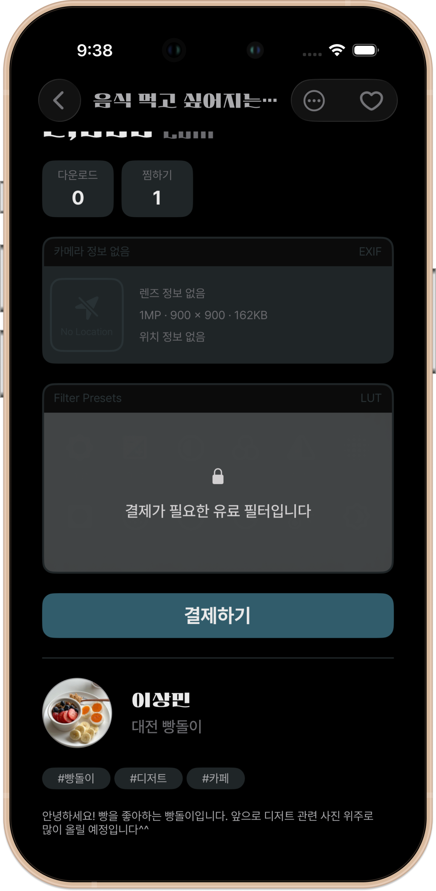
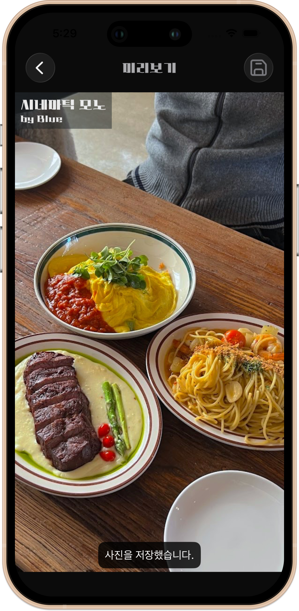
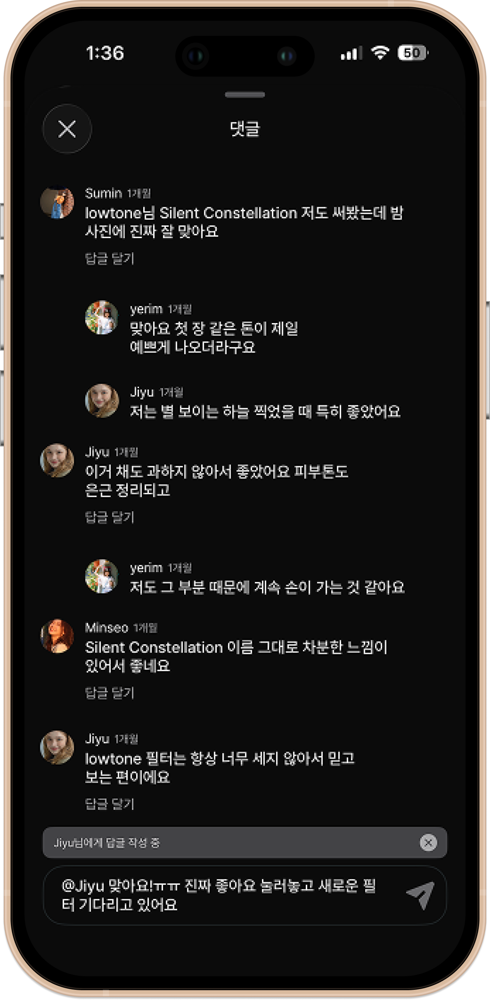
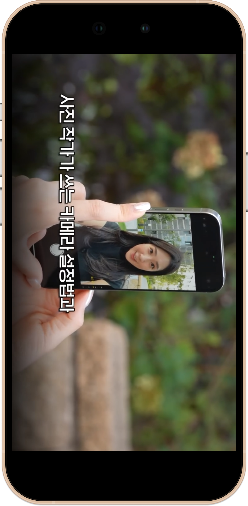
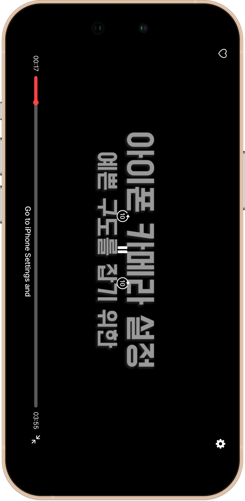
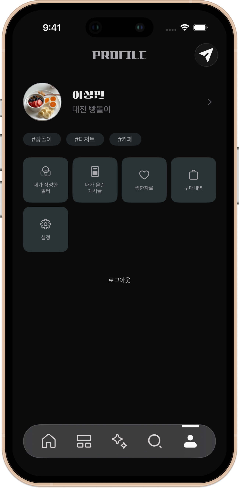

<h1>
  
  Filo
</h1>

Filo는 사용자가 사진 필터를 제작하고 공유하며, 커뮤니티·실시간 채팅·VOD·결제 기능을 함께 이용할 수 있는 iOS 앱입니다. UIKit 기반의 MVVM + Input/Output 구조를 적용했고, RxSwift와 async/await를 함께 활용해 로그인, 결제, 푸시, 실시간 채팅, 미디어 업로드처럼 실제 운영 환경에서 요구되는 시나리오를 구현했습니다.

| 항목 | 내용 |
|---|---|
| 개발 기간 | 2025.12 - 2026.02 |
| 담당 역할 | iOS App Developer |
| 프로젝트 성격 | 팀 프로젝트 |
| 최소 지원 버전 | iOS 16.0+ |

## 핵심 기능

| 도메인 | 구현 내용 |
|---|---|
| 인증 | 이메일 회원가입/로그인, 카카오 로그인, Apple 로그인, Keychain 기반 토큰 저장, 만료 토큰 자동 갱신 |
| 홈 | 오늘의 필터, 카테고리, 핫 트렌드, 오늘의 작가, WebView 이벤트 배너 |
| 피드 | Top Ranking 캐러셀, 리스트/블록 모드 전환, 정렬, 무한 스크롤, 좋아요 낙관적 반영 |
| 필터 | 이미지 선택, EXIF 메타데이터 추출, Core Image 기반 12개 조절값 편집, 원본/적용 이미지 비교, 필터 등록/수정/삭제 |
| 필터 구매 | 결제 상태에 따른 조절값 잠금/해제, 구매 후 사진 적용 및 저장 |
| 커뮤니티 | 게시글/사용자 검색, 게시글 작성/상세/수정/삭제, 이미지/동영상 혼합 미디어, 댓글/대댓글 |
| 채팅 | Socket.IO 기반 실시간 메시지, Realm 로컬 저장, 이미지/PDF 첨부, PDF 미리보기, unread 배지 |
| 알림 | Firebase Messaging, FCM/APNs 토큰 관리, 포그라운드 알림, 채팅방 딥링크 |
| VOD | HLS 스트리밍, 커스텀 AVPlayer, 화질/속도/자막 제어, 전체 화면 전환 |
| 보안 | 커스텀 앱 잠금, 생체 인증, 앱 스위처 민감 정보 보호 화면 |

## 주요 화면

| 로그인 | 회원가입 | 메인화면(오늘의 필터) | 메인화면(핫 트랜드 & 오늘의 작가) |
|:---:|:---:|:---:|:---:|
|  |  |  |  |
| 배너 웹 브릿지 | 배너 웹 브릿지 동작 | 피드(탑 랭킹) | 피드 리스트 |
|  |  |  |  |
| 필터 등록  | 필터 생성 | 필터 편집 | 필터 상세 |
|  |  |  |  |
| 필터 상세(결제 전) | 필터 상세(결제 후) | 필터 적용 미리보기 | 커뮤니티 탐색 |
|  |  |  |  |
| 게시글 상세 | 게시글 작성 | 댓글 | 채팅 목록 |
|  |  |  |  |
| 채팅방 | 결제 | 영상 목록 | 영상 재생 |
|  |  |  |  |
| 영상 재생(자막) | 프로필 |  |  |
|  |  | |  |

## 기술 스택

| Category | Stack |
|---|---|
| Language | Swift |
| UI | UIKit, SnapKit |
| Architecture | MVVM, Input/Output |
| Reactive | RxSwift, RxCocoa |
| Network | Alamofire |
| Auth | Kakao SDK, Sign in with Apple |
| Security | Keychain, LocalAuthentication |
| Media | Core Image, ImageIO, AVFoundation, HLS |
| Image | Kingfisher |
| Realtime | Socket.IO |
| Local DB | Realm |
| Push | Firebase Messaging |
| Web | WebKit |
| Payment | iamportSDK |
| Others | IQKeyboardManager, Toast-Swift |

## 아키텍처

화면, 상태 관리, 네트워크 요청, 로컬 저장소의 역할을 나눠 구성했습니다. 화면에서는 사용자 입력과 렌더링을 담당하고, 상태 변경과 비즈니스 로직은 ViewModel과 Store에서 처리합니다.

### 화면 흐름

사용자가 탭, 입력, 스크롤 이벤트를 발생시키면 화면은 이를 ViewModel로 전달합니다. ViewModel은 API 호출, 데이터 가공, 에러 처리, 화면 상태 변경을 담당하고, 화면은 전달받은 상태를 기준으로 UI를 갱신합니다.

이 구조를 적용하면서 ViewController에 화면 로직이 몰리는 것을 줄였습니다. 좋아요, 댓글, 채팅 unread처럼 여러 화면에서 같이 사용하는 상태는 Store에서 관리했습니다.

### 레이어별 역할

| 계층 | 역할 |
|---|---|
| View | 화면 구성, 사용자 이벤트 수집, ViewModel 출력 바인딩 |
| ViewModel | 화면 상태 관리, API 호출 흐름 제어, 데이터 가공, 에러 분기 |
| Store | 여러 화면에서 공유되는 상태 관리, 좋아요/unread/채팅 로컬 상태 동기화 |
| Network | API 요청 공통 처리, 토큰 갱신, 에러 매핑, 재시도 정책 |
| Router | 도메인별 endpoint, method, header, parameter 정의 |
| Local DB | Realm 기반 채팅 메시지/채팅방 요약/사용자 캐시 저장 |
| Service | 인증, 채팅 소켓, 결제 검증, 앱 잠금처럼 화면 밖 도메인 로직 처리 |

네트워크 요청은 `APITarget`과 도메인별 Router로 정의하였고, `NetworkManager`에서는 공통 에러 매핑, 인증 만료 감지, 토큰 refresh, 원 요청 재시도, 세션 만료 처리를 담당했습니다.

## 핵심 구현 포인트

### 1. 토큰 갱신 동시성 제어

인증이 필요한 API 요청에서 access token 만료가 감지되면 refresh를 수행한 뒤 원래 요청을 자동으로 다시 실행합니다.

- access token 만료 또는 unauthorized 응답 발생 시 인증 헤더가 포함된 일반 요청만 refresh 대상에 포함
- `/auth/refresh` 요청 자체는 재귀 재시도 대상에서 제외
- refresh 성공 시 원 요청 재실행
- refresh 실패 시 세션 만료로 간주해 토큰 정리 후 로그인 화면으로 전환

### 2. 원본 메타데이터 보존

필터 등록 화면에서는 이미지뿐 아니라 촬영 장비, 촬영 조건, 위치 정보를 추출해 필터 상세 정보로 제공합니다.
`PHPickerResult.assetIdentifier`가 있으면 먼저 `PHAsset`을 통해 원본 파일에 접근하고, 원본을 가져오지 못한 경우에만 선택 결과의 `Data`에서 메타데이터를 읽습니다.

GPS 정보가 있으면 `CLGeocoder`로 주소를 변환하며, 필터 등록 요청에는 카메라, 렌즈, 초점거리, 조리개, ISO, 셔터스피드, 이미지 크기, 파일 크기, 좌표 정보를 모두 포함합니다.

### 3. Core Image 기반 필터 편집

밝기, 대비, 채도, 온도, 하이라이트, 그림자, 선명도 등의 조절값은 Core Image 기반으로 순차 적용됩니다. 조절값이 변경될 때마다 필터를 다시 적용해 결과 이미지를 렌더링하고, 편집 화면에서는 원본과 필터 적용 이미지를 분리해 비교할 수 있게 했습니다.

구매 전 상세 화면에서는 조절값 영역이 잠기며, 구매 후에는 사용자가 선택한 사진에 필터를 적용한 뒤 미리보기와 앨범 저장까지 이어지도록 구성했습니다.

### 4. 미디어 업로드 용량 제어

커뮤니티 작성 화면에서는 이미지와 동영상을 함께 첨부할 수 있으며, 업로드 전에 파일별 제한 기준에 맞춰 미디어를 전처리합니다. 이미지는 ImageIO 기반 다운샘플링 후 JPEG 품질을 단계적으로 낮추고, 동영상은 `AVAssetExportSession`의 `MediumQuality`에서 `LowQuality` 순서로 재압축합니다. 
- 파일당 제한: 5MB
- 이미지: 1080px 기준 다운샘플링 후 JPEG 품질 단계 조정
- 동영상: 중간 품질 압축 실패 또는 용량 초과 시 낮은 품질로 재압축
- 제한을 넘는 파일은 목록에서 제외하고 사용자에게 경고 메시지 표시

### 5. 좋아요 낙관적 UI와 응답 순서 보정

좋아요 액션은 사용자가 입력한 직후 UI에 먼저 반영되고, 서버 응답이 도착하면 실제 응답값으로 상태를 다시 맞춥니다.
항목별로 요청 번호를 부여해 최신 요청과 일치하는 응답만 반영하며, 실패할 경우 이전 상태로 되돌립니다.

### 6. 채팅 메시지 동기화와 unread 처리

채팅 메시지는 서버 이력 조회와 Socket.IO 실시간 수신을 함께 사용해 동기화했습니다. 새 메시지는 `chatId`를 기준으로 중복 여부를 확인한 뒤 저장하고, 현재 보고 있는 채팅방과 발신자에 따라 unread 증가 여부를 판단했습니다.

- 현재 보고 있는 방이면 unread 0
- 다른 채팅방에서 상대방 메시지가 도착한 경우에만 +1
- unread는 앱 내부 채팅 목록에서 최대 `300+`로 표시
- 채팅방 진입 시 해당 방의 unread를 즉시 0으로 갱신

### 7. 채팅 첨부와 프로필 캐시 최신화

채팅 메시지는 텍스트, 이미지, PDF 첨부를 각각 분리해 전송하며, PDF는 첫 페이지 썸네일을 생성해 채팅 셀에서 미리볼 수 있게 했습니다. 원본 파일은 Quick Look으로 연결해 대화 흐름을 벗어나지 않고 확인할 수 있습니다.

채팅과 댓글 리스트의 프로필 이미지는 로딩 전에 이전 다운로드를 취소하고, 캐시 키와 바인딩 키를 검증해 현재 셀의 사용자와 일치하는 이미지만 반영합니다. 채팅 사용자 정보는 Realm에 upsert해 목록과 대화 화면에서도 변경된 프로필이 반영되게 했습니다.

### 8. 커스텀 HLS 플레이어

AVPlayer를 기반으로 재생 화면, 오버레이 컨트롤, 진행 바, 10초 이동, 전체 화면 전환, 재생 속도, 자막 선택, 화질 선택을 직접 구현했습니다. 화질 변경은 마스터 스트림의 `preferredPeakBitRate`를 조절하는 방식으로 처리했습니다.

자막은 URL의 `.srt` 내용을 cue 단위로 파싱한 뒤 현재 재생 시간에 해당하는 문구를 화면에 동기화합니다.

### 9. PG 결제 검증

구매 확정은 SDK 성공 콜백만으로 처리하지 않습니다.
`imp_uid`를 서버에 전달해 영수증 검증이 성공한 경우에만 구매 완료 화면으로 이동합니다.

### 10. WebView 브릿지와 푸시 딥링크

홈 배너는 WebView로 진입하며, 웹 이벤트 완료는 `WKScriptMessageHandler`를 통해 앱으로 전달됩니다.
웹에서 전달된 이벤트 값을 기준으로 앱 내부 화면 이동이나 완료 처리를 이어가도록 구성했습니다.

채팅 푸시는 payload의 `room_id`를 기준으로 채팅방으로 라우팅하며, 앱이 종료된 상태에서도 탭바와 네비게이션 구성이 준비될 때까지 재시도해 딥링크 유실을 최소화했습니다.

### 11. 앱 잠금과 백그라운드 보호

사용자가 잠금을 설정하면 앱 전환, 백그라운드 진입, 재활성화 흐름 전반에서 보호 화면이 유지됩니다.
앱 스위처 미리보기에 민감한 채팅이나 프로필 정보가 노출되지 않도록 커버 뷰를 올리고, 재진입 시에는 커스텀 비밀번호 또는 LocalAuthentication 기반 생체 인증으로 잠금을 해제합니다.

## 트러블슈팅

### Token refresh 중복 호출

- 문제: 여러 API가 동시에 토큰 만료를 감지하면 각 요청마다 refresh를 다시 수행해, 요청별로 사용하는 access token이 서로 달라지는 문제가 있었습니다.
- 해결: `TokenStorage`를 actor로 구성하고 진행 중인 `refreshTask`를 공유해 모두가 동일한 refresh 결과를 기다리도록 처리했습니다.
- 결과: 여러 요청이 동시에 401을 받아도 refresh API는 한 번만 호출되고, 갱신된 토큰으로 각 요청을 다시 실행할 수 있게 됐습니다.

### PHPicker 메타데이터 유실

- 문제: PHPicker 선택 이미지를 `UIImage`로 변환해 처리하면 원본 파일의 EXIF, TIFF, GPS 정보를 읽지 못하는 경우가 있었습니다.
- 해결: `assetIdentifier`를 통해 `PHAsset` 원본 파일에 먼저 접근하고, 실패한 경우에만 선택 결과 `Data`에서 ImageIO 기반 메타데이터를 추출했습니다.
- 결과: 원본 접근이 가능한 이미지는 촬영 정보를 유지했고, 접근에 실패한 경우에도 이미지 등록은 계속 진행할 수 있었습니다.

### 미디어 업로드 용량 제한

- 문제: 고해상도 이미지나 동영상이 파일당 5MB 제한을 넘으면 게시글 등록 자체가 실패했습니다.
- 해결: 이미지는 1080px로 다운샘플링한 뒤 JPEG 품질을 `0.95 -> 0.9 -> 0.8 -> 0.7 -> 0.6` 순서로 낮추고, 동영상은 `MediumQuality -> LowQuality` 순서로 재압축했습니다.
- 결과: 업로드 가능한 파일은 그대로 유지하고, 끝까지 제한을 넘는 파일만 제외했습니다.

### 채팅 프로필 캐시 최신화

- 문제: 로컬에 저장된 사용자 정보를 그대로 노출하면 채팅 목록과 대화 화면에 이전 프로필 이미지나 닉네임이 남을 수 있었습니다.
- 해결: 채팅 목록과 메시지 응답에 포함된 사용자 정보를 Realm에 upsert하고, 필요할 때 상대 프로필을 별도로 조회해 캐시를 보정했습니다.
- 결과: 매번 프로필 API를 호출하지 않으면서도, 채팅 목록과 대화 화면에 오래된 사용자 정보가 남는 경우를 줄였습니다.

### 채팅 소켓 연결 타이밍

- 문제: 채팅방에 진입한 직후 서버 이력을 불러오는 동안 새 소켓 메시지가 도착하면, 초기 동기화가 끝나기 전에 받은 메시지가 화면에 반영되지 않을 수 있었습니다.
- 해결: 동기화 중 수신한 소켓 메시지를 임시로 보관하고, 서버 이력 조회가 끝난 뒤 메시지 고유값을 기준으로 함께 병합했습니다.
- 결과: 채팅방 진입 시점에 들어온 실시간 메시지도 유실되지 않고 대화 목록에 반영되도록 처리했습니다.

### HLS 화질 변경 시 재생 리셋

- 문제: 화질을 선택할 때마다 `AVPlayerItem`이 재구성되어 영상이 다시 처음부터 재생되는 상황이 발생했습니다.
- 해결: 화질별 URL 교체 대신 `preferredPeakBitRate`를 우선 사용해 마스터 스트림의 비트레이트 상한을 조절했습니다.
- 결과: 화질을 변경해도 기존 재생 위치를 유지할 수 있었습니다.

## 회고

Filo를 개발하면서 가장 많이 신경 쓴 부분은 여러 경로에서 동시에 바뀌는 상태를 어떻게 관리할지였습니다. 특히 토큰 refresh, 채팅 unread, 소켓 메시지처럼 비동기 처리가 겹치는 기능은 각 화면에서 따로 처리하면 예외 케이스가 빠르게 늘어났습니다. 그래서 상태를 변경하는 지점을 Store나 로컬 저장소 쪽으로 모으고, 같은 로직을 여러 화면에서 반복하지 않는 방향으로 구조를 정리했습니다.

기능이 정상적으로 동작하는지만 보는 것보다, 실패하거나 여러 이벤트가 동시에 들어왔을 때 상태가 어떻게 변하는지까지 확인하는 게 중요하다는 점을 배웠습니다.
